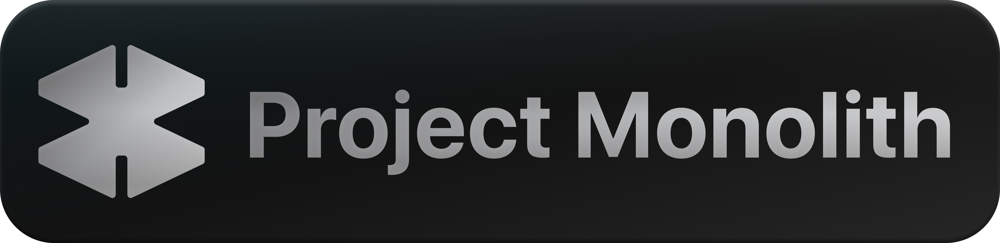

**Monolith** is a brutalist, lightweight desktop launcher for **OpenCode**. Built to eliminate terminal friction, it provides a specialized native wrapper to manage project directories, configurations, and session launches through a high-performance, low-RAM interface.

## 🚀 Core Features

### 📂 One-Click Orchestration
- **Instant TUI Launch**: Select a project directory via the native picker and jump directly into an OpenCode session. No manual `cd` or terminal initialization required.
- **Project Persistence**: Remembers your recent workspaces for rapid re-entry into development flows.

### 🛠️ The Command Center (Settings)
Monolith centralizes your OpenCode environment through a three-tab architecture:
- **Setup**: Handles initial bootstrapping. Automatically deploys Monolith’s optimized config files to `~/.config/opencode/` and manages your **21st.dev** API keys. Includes an optional preset of Noah’s personal Monolith configurations.
- **Config**: A built-in, live JSON editor for `opencode.json`. Modify your environment variables and logic on the fly with integrated save and hot-reload support.
- **Updater**: Maintains system integrity by checking for app updates and pulling the latest configuration schemas directly from GitHub.

### 🌑 Aesthetics & Philosophy
- **Brutalist UI**: A pure black (`#000000`) interface utilizing condensed all-caps typography. 
- **Monochromatic Precision**: Zero decorative elements. Designed to look and feel like a native low-level development tool rather than a consumer app.
- **Efficiency First**: Built with **PyWebView** to ensure a minimal RAM footprint, offering a stark alternative to bloated Electron-based launchers.

---

## 🛠️ Tech Stack

- **Backend**: **Python 3.12** managing filesystem operations, subprocess orchestration, and config deployment.
- **Frontend**: **HTML5 / CSS3 / Vanilla JS** — high-performance, zero-framework architecture.
- **Wrapper**: **PyWebView** for a hardware-accelerated native window experience.
- **Communication**: Inter-process bridge between the Python backend and the OpenCode TUI environment.

---

## 📥 Installation

### 1. Prerequisites
Ensure you have [Python 3.12+](https://www.python.org/) and [OpenCode](https://github.com/opencode) installed on your system.

### 2. Setup
```bash
# Clone the Monolith repository
git clone https://github.com/noahain/monolith

# Enter the directory
cd monolith

# Install requirements
pip install -r requirements.txt

# Launch Monolith
python main.py
```

---

## 🤖 Agentic Development

Monolith was engineered through an advanced **Human-AI Collaboration** workflow:
- **Lead Architect:** Noahain (Product Vision & Design Language)
- **Primary Developer:** **OpenCode** (Powered by **Kimi K2.6**) — Implemented the TUI wrapping logic, directory orchestration, and the persistent configuration bridge.
- **Technical Consultant:** **DeepSeek V4 Pro MAX** — Optimized the backend filesystem handlers and refined the monochromatic UI responsiveness.


**License:** MIT  

Built for the speed of thought. By developers, for developers.
